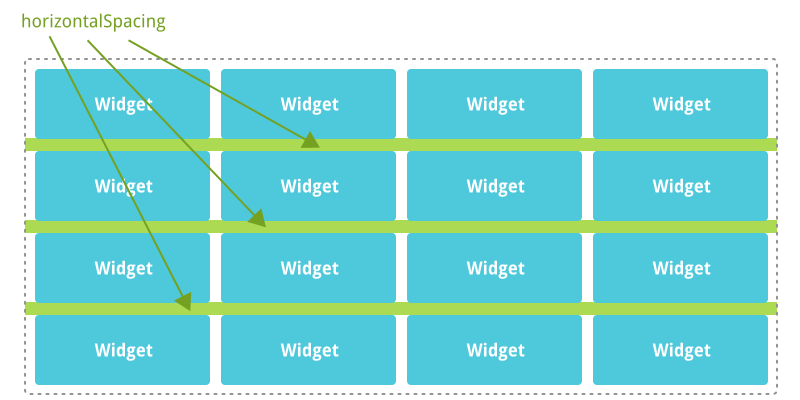
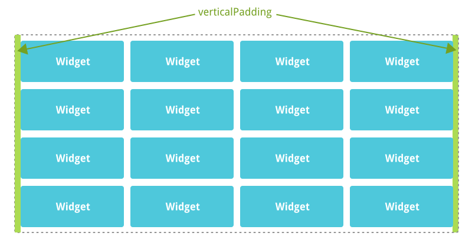
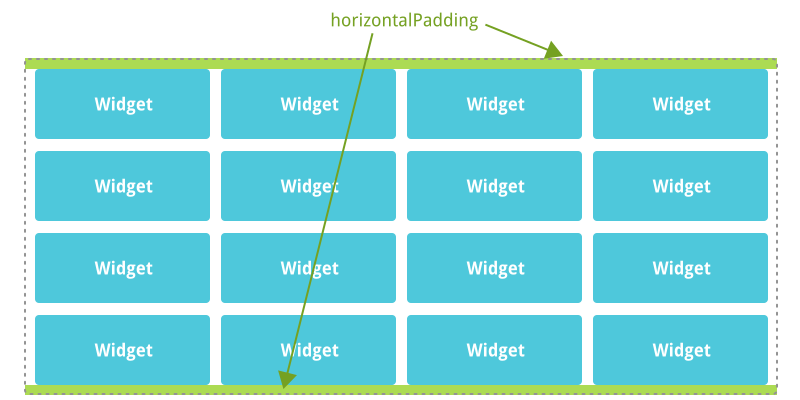
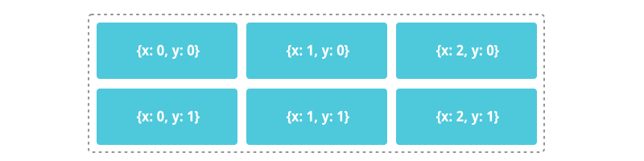

title: GridLayout
layout: page-width-demo
demo_script: doc/widgets/gridlayout.js
---

`photonui.GridLayout` is a layout widget that allows you to align widgets on a 2D grid.

### Global Options

`photonui.GridLayout` provides options to define its look and feel. Global options are applied to the layout itself.

#### verticalSpacing

Defines the vertical spacing between the widgets (5px by default).

#### horizontalSpacing

Defines the horizontal spacing between the widgets (5px by default).

#### verticalPadding

Defines the spacing between the widgets and the left and right edge of the layout (0px by default).

#### horizontalPadding

Defines the spacing between the widgets and the top and bottom edge of the layout (0px by default).

### Layout Options

`photonui.GridLayout` allows widgets to set plenty of options to customize the way they are displayed in the layout. Layout options are associated with only one widget of the layout.

#### x, y

Defines the widget position in the grid.

#### rows

Defines the number of rows the widget will fill (default = `1`).

#### cols

Defines the number of columns the widget will fill (default = `1`).

#### verticalAlign

Defines how the widget must be vertically aligned in the layout.

Possible values:

* `stretch` (default, alias: `expand`): the widget is stretched to take all available vertical space in its box,

* `start` (alias: `top`): the widget is placed at the top of its box,

* `center` (alias: `middle`): the widget is vertically centered in its box,

* `end` (alias: `bottom`): the widget is placed at the bottom of its box.

#### horizontalAlign

Defines how the widget must be vertically aligned in the layout.

Possible values:

* `stretch` (default, alias: `expand`): the widget is stretched to take all available horizontal space in its box,

* `start` (alias: `left`): the widget is placed at the left of its box,

* `center` (alias: `middle`): the widget is horizontally centered in its box,

* `end` (alias: `right`): the widget is placed at the right of its box.

#### width

Defines the fixed width of the widget (default = `null`, `null` means "auto").

#### minWidth

Defines the minimum width of the widget (default = `null`, `null` means no limitation).

#### maxWidth

Defines the maximum width of the widget (default = `null`, `null` means no limitation).

#### height

Defines the fixed height of the widget (default = `null`, `null` means "auto").

#### minHeight

Defines the minimum height of the widget (default = `null`, `null` means no limitation).

#### maxHeight

Defines the maximum height of the widget (default = `null`, `null` means no limitation).

### Class Reference

* [{{ title }} class reference](../../ref/classes/photonui.{{ title }}.html)

